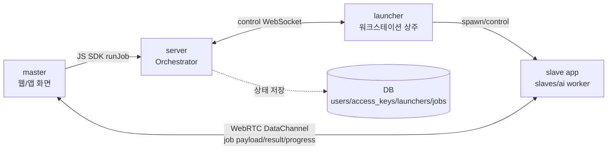

# GP Station (gps.qutat.com)

## 제공 가치
- 고성능 컴퓨터를 Worker 로 돌려놓고, 컴퓨팅 자원이 부족한 환경(모바일, 노트북, 웹서버 등)에서 API 처럼 사용한다.
- 대상 : 로컬 AI 모델(LLM, SDXL 등) 사용을 위해 VRAM 24 GB 이상급 워크스테이션을 보유하고 있는 리테일 사용자.

## 용어 설명

#### master
* 사용자의 웹페이지 화면
* 챗봇, 게임, 이미지 편집, CAD/CAE Workbench 등 다양한 Retail App

#### slave
* 워크스테이션에서 실제 구체적인 작업이 돌아가는 subprocess
* AI 추론, 생성 AI, 시뮬레이션 등 다양한 고성능 HW 요구 작업

#### launcher
* 워크스테이션에서 slave subprocess 를 실행/종료/제어하는 프로그램
* server 와 websocket 연결을 상시 유지하며, server 의 지시에 따라 동작

#### server
* master 의 작업 요청을 받아 적절한 launcher 를 중개해주는 Ochestrator
* master 와 slave 간 WebRTC DataChannel 연결만 시켜주며, 실제 작업 내용은 볼 수 없음

#### SDK (Software Development Kit)
- 다양한 slave app, master app 을 개발할 수 있음
  * 연결 관련 공통 프토토콜, 로직들은 SDK 내부로 캡슐화
- Master 측 활용
  * SDK 의 runJob 함수를 호출하기만 하면 slave 에서 처리한 결과물 및 A/S session handler 를 return
- Slave 측 활용
  * SDK 의 SlaveApp 을 띄우면 알아서 다양한 master 로부터의 작업 요청이 하나씩 handler 로 들어옴

## 작동 원리

자세한 로컬 실행 순서와 API 흐름은 [app_v1/tutorial.md](app_v1/tutorial.md)를 참고한다.

